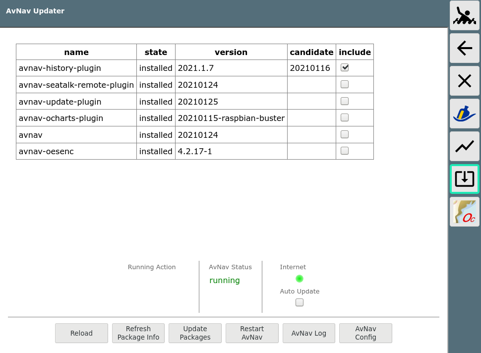

AvNav Updater Plugin
====================

This plugin provides a way to update the [AvNav](https://www.wellenvogel.net/software/avnav/docs/beschreibung.html?lang=en) software without the need to access the command line.


It integrates itself into the AvNav user apps and this way can be started directly from within AvNav.
As it runs an own service it can also be accessed independent from AvNav with an url of the form
```
http://<avnavhost>:8085/index.html
```
Where avnavhost is the same host that AvNav is running on.
