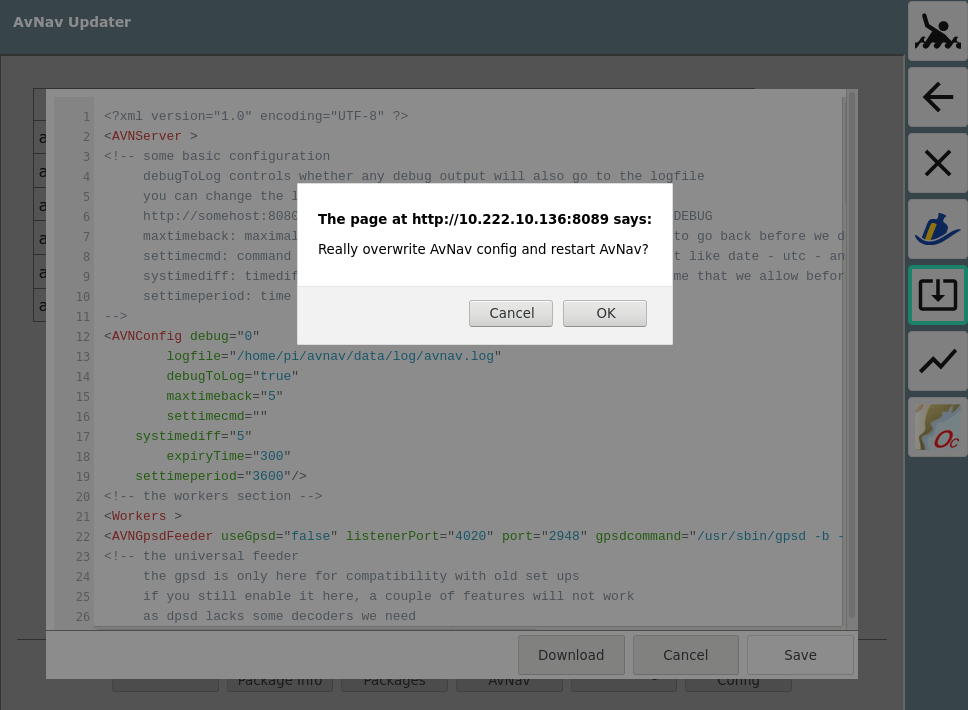

AvNav Updater Plugin
====================

This plugin provides a way to update the [AvNav](https://www.wellenvogel.net/software/avnav/docs/beschreibung.html?lang=en) software without access to the command line.


It integrates itself into the AvNav user apps and this way can be started directly from within AvNav.
As it runs an own service it can also be accessed independent from AvNav with an url of the form
```
http://<avnavhost>:8085/index.html
```
Where avnavhost is the same host that AvNav is running on. This can be helpfull if your AvNav server ist not starting up or you cannot reach it.

Beside the update function it allows to edit the AvNav config file and display and download the AvNav log file.

Installation
------------
The plugin will come preinstalled on the [AvNav headless images](https://www.wellenvogel.net/software/avnav/docs/install.html?lang=en#h2:ImagewihoutattacheddisplayHeadless) in versions after 20210126.
If it is not installed (you will miss the icon on the AvNav user page) you can install it by hand (using the command line just a last time...)
```
sudo apt-get update
sudo apt-get install avnav-update-plugin
sudo systemctl restart avnav
```

Usage
-----
When you select the user app in AvNav (or directly open the url `http://<avnavhost>:8085/index.html`) in your browser you will get the view shown in the picture above.
In the upper left the AvNav packages that are installed (or can be installed) on your system are listed, in the "candidate" column you will see newer versions that could be installed. The ceckboxes in the include column will give you a chance to decide which packages you would like to update.

Below the table there is a display for the currently running action (if any), the status of the AvNav server and an information whether you have a working internet connection.
In the bottom part you have the buttons that will trigger the actions.

**Reload**

Read the list of packages again.


**Refresh Package Info**

Run `apt-get update` to update the package informations. This will set the system time with ntpdate and will stop AvNav before.

After fetching the information AvNav is started again and the packge table is updated.

**Update Packages**

This will run the update of the selected packages. AvNav is stopped, the system time is set with `ntpdate`, `apt-get update` is run and for each for the selected packages an `apt-get install ...` is run.


**Restart AvNav**

The AvNav server is restarted.

**AvNav Log**

The last app. 100000 bytes of the AvNav log file are shown.

You can download the complete log from there.


**AvNav Config**

This allows you to edit the config file for AvNav.

**WARNING:**
Be sure to carefully read the [documentation](https://www.wellenvogel.net/software/avnav/docs/hints/configfile.html?lang=en) - you can easily let AvNav fail to start.
AvNav is trying to fall back to the last valid configuration if you change the config file in a way that would otherwise prevent a start up completely.
The editor will at least detect a couple of basic XML syntax errors - but it is not able to check if you create a valid AvNav configuration.


Within the editor you can dwonload the config file. When you are done and click save you will be prompted again before the config is written and AvNav is restarted.



Everytime you change the config a backup of the current config will be written to the directory where the AvNav config file is located.


Technical Details
-----------------

The plugin consists of 2 parts:

- the plugin inside AvNav. This will only register the User App and will forward you to the second part
- an own service that runs by default on port 8085. <br>
  This service provides the described functions.

During installation the service `avnavupdater` is created and you can control it with systemctl.  
Additionally a sudo configuration is created that will allow the user to handle all the necessary package actions.
If the user _pi_  is available on the system, the service will run with this user. Otherwise it will run with the user avnav (that is used by AvNav if you install it on a "bare" linux system - not on the raspberry).

If you need to change the configuration of the service, there is already a template for your changes being created at
`/etc/systemd/system/avnavupdater.service.d/override.conf`.

So if you need to change the port or the user, just edit this file and follow the instructions inside.

